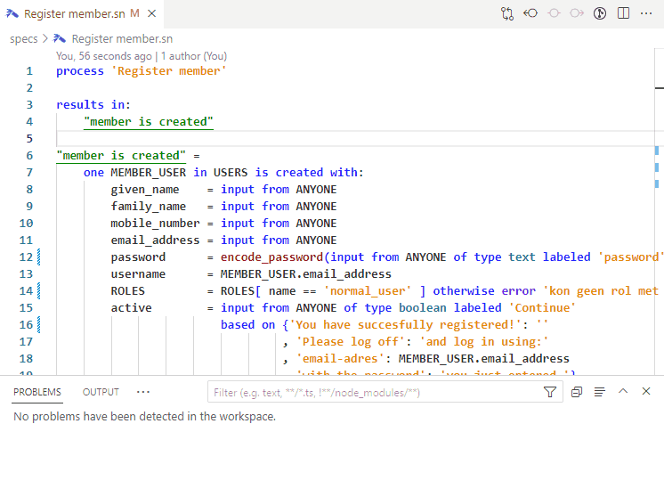

# vscode-gears README

Support for SMART notation v3.0 (requirements specification language) as supported by GEARS (see www.xlrit.com).

To publish: 
- Update `CHANGELOG.md`
- adjust version number in package.json
- execute `npm install`
- execute `vsce publish` (for more details see https://code.visualstudio.com/docs/extensions/publish-extension).

# Prerequisites

- GEARS must be installed (to be able to generate).
- Set environment variables: 
  - `GEARS_RELEASES` must point to the GEARS installation folder.
  - `PATH` should include a path to the `gears-generate` and `gears-server` GEARS [scripts](https://gitlab.xlrit.com/xlrit/gears/scripts).
- Java 21 or higher must be installed (to be able to compile). We recommend [Temurin JDK](https://adoptium.net/temurin/releases/) 21.

# How to use

## Problems

Just open a SMART Notation (GEARS) project. In the **Problems** pane it will show all problems in the current file. As normal you can click on a problem to jump to it. Note that this requires you have the GEARS Generator under GEARS_RELEASES (v1.12.5 or higher) and a matching `"generatorVersion"` defined in file `gears.json`. 

## Snippets

For snippets either press CTRL+SHIFT+P, type 'snip', choose 'Insert snippet' before choosing the snippet you want. Each snippet is documented explaining what it is for and how to use it. All snippets can also be selected after typing the first characters except the 'todef' snippet. This snippet requires you to select text first and choose snippet using `CTRL+SHIFT+P` as shown below:

## Tasks

Press `CTRL+SHIFT+B`, then choose a task. They are already in logical order.

Below is an example demo of how to call the task `GEARS: 1. Generate`:

## Commands

We probably will move the tasks to commands which can be activated with CTRL+SHIP+P as most users of VS Code are used to. For now (as a test) we have only duplicated the task `GEARS 2. Diagrams` as the command `GEARS: Show Diagrams`. This is also an improved version of Diagrams because it will work on all platforms and you can choose the browser of you own liking. 

## Settings

Since version 0.11.0 many settings are configured using `gears.json` in the workspace root. Below is an example which also shows the parameter names you should use:

    {
        "projectName":      "leave_of_absence",
        "projectVersion":   "0.1-SNAPSHOT",
        "generatorVersion": "0.64",
        "runtimeVersion":   "0.54.1",
        "runnerVersion":    "0.14",
        "plugins":          [
            "com.xlrit.gears.runtime:gears-runtime-plugin-mail"
        ]
    }

Additional settings can be configured using VSCode's configuration mechanism (CTRL+, and then search for GEARS).
